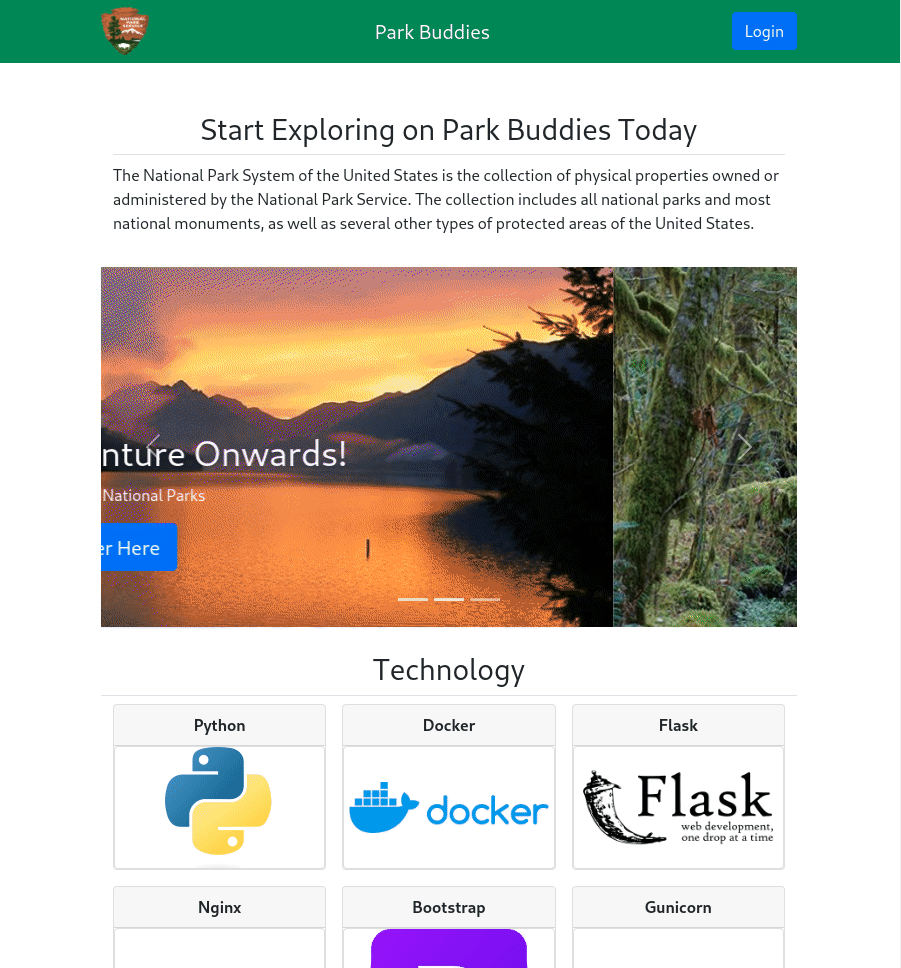

# Park Buddies

**Note**  
Currently in the process of being refactored and overhauled to take advantage of new features on Flask.

## Description
<!-- 
Provide a short description explaining the what, why, and how of your project. Use the following questions as a guide:

- What was your motivation?
- Why did you build this project? (Note: the answer is not "Because it was a homework assignment.")
- What problem does it solve?
- What did you learn? -->

A web application to find National Parks to explore and find information about current operations. Started out as the Capstone project, but has since moved into a fun personal project.


## Table of Contents (Optional)
<!-- If your README is long, add a table of contents to make it easy for users to find what they need.
 -->
- [Installation](#installation)
- [Usage](#usage)
- [Credits](#credits)
- [License](#license)

## Installation
<!-- What are the steps required to install your project? Provide a step-by-step description of how to get the development environment running. -->

### Docker Compose  
1. Copy this repository and run the command: `docker compose up`  
2. This will build the images necessary to run this project.  

<!-- **Docker**  
A ready to use Docker image should be hosted in the GitHub Packages Container Registry.  
* Simply pull the image from this repository with: `docker pull ghcr.io/kev-odin/park-buddies:latest`  
* Run the image with this command: `docker run park-buddies:latest`  
* Then open your web browser and enter `localhost:5000` in the address bar. -->

### Local Installation
1. Clone this repository: `git clone git@github.com:kev-odin/park-buddies.git`
2. Create a virtual environment: `python3 -m venv venv`
3. Start venv: `source venv/bin/activate`
4. Install project requirements: `pip install -r flask-web/requirements.txt`
5. Run: `python3 flask-web/app.py`
6. Open a web browser to this URL: `localhost:5000`

## Usage
<!-- 
Provide instructions and examples for use. Include screenshots as needed.

To add a screenshot, create an `assets/images` folder in your repository and upload your screenshot to it. Then, using the relative filepath, add it to your README using the following syntax:

    ```md
    
    ```
 -->
 

## Tech Stack


## How to Contribute
If you are intrested in contributing to this project, feel free to create an issue, fork the repository, and create a pull request. If new features are added, write relevant unit and integration tests to ensure code coverage.

## License
Park Buddies is licensed under the [MIT License](LICENSE.txt).
